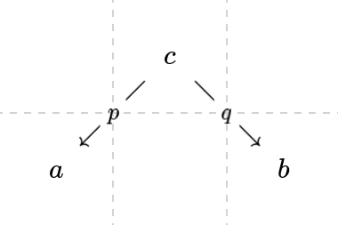
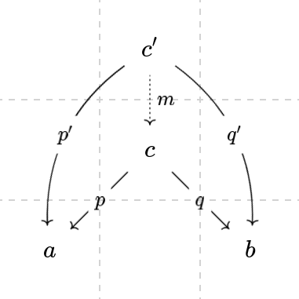
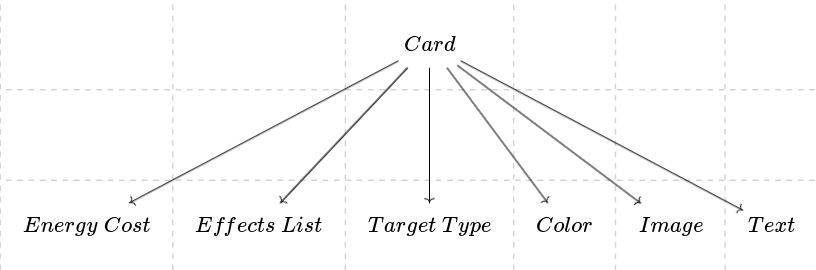
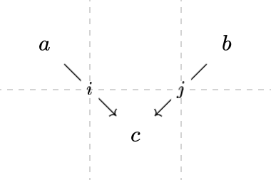
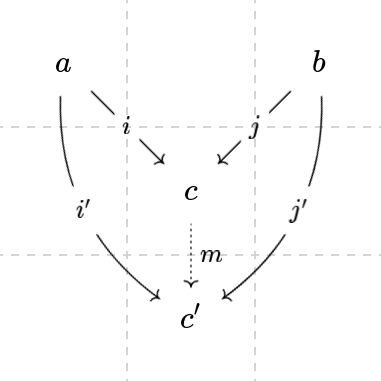

# Mathematics of Structure: Applied Category Theory For Game Development

Use the RPG stats graph as an example

## Intro to Category Theory - objects and arrows
## Sample of larger ideas from Category Theory
### Product
A product in Category Theory is the abstracted idea of a Cartesian product in Set Theory. The most basic idea of the product is that we have a product object `c` from which we can derive the components `a` and `b` that make up object `c` [like so](https://q.uiver.app/#q=WzAsMyxbMSwwLCJjIl0sWzAsMSwiYSJdLFsyLDEsImIiXSxbMCwxLCJwIiwxXSxbMCwyLCJxIiwxXV0=):

If you dig deeper into the literature, you'll come across the the formal definition, which is a little bit more complex. Summarized it means the following must hold:
- There is a projection arrow `p` from the product object `c` to the object `a`
- There is a projection arrow `q` from the product object `c` to the object `b`
- There is a candidate object `c'` with 3 arrows:
    - `p'` from `c'` to `a`
    - `q'` from `c'` to `b`
    - A factoring arrow `m` from `c'` to `c`
What makes `c` the product of `a` and `b` instead of `c'` is the existance of the factoring arrow `m` also factors the morphisms `p'` and `q'`, such that:
- `p' = p∘m`
- `q' = q∘m`

When diagrammed, it looks like [this](https://q.uiver.app/#q=WzAsNCxbMSwxLCJjIl0sWzAsMiwiYSJdLFsyLDIsImIiXSxbMSwwLCJjJyJdLFswLDEsInAiLDFdLFswLDIsInEiLDFdLFszLDEsInAnIiwxLHsiY3VydmUiOjJ9XSxbMywyLCJxJyIsMSx7ImN1cnZlIjotMn1dLFszLDAsIm0iLDAseyJzdHlsZSI6eyJib2R5Ijp7Im5hbWUiOiJkb3R0ZWQifX19XV0=):

This is the universal constructor for a product, but the gist of it is that it corresponds to the following ideas:
- Cartesian Product in Set Theory
- Conjunction (`AND`) in logic
- Objects in Object Oriented Programming
- Objects in JSON and JavaScript
- Records in other programming languages
- Tuples

It's important to note that the product gets its name from the number of possible composites that construct it (you multiply the possible values for each component to get the number of values the composite can be).

#### How This Applies to Game Design
Let's consider _Slay the Spire_, every card has the following components:
- An energy cost
- A list of effects
- A target type (player, single enemy, random enemy, all enemies)
- A color
- An image
- Text

When represented as a product category, it would look like [this](https://q.uiver.app/#q=WzAsNyxbMiwwLCJDYXJkIl0sWzAsMiwiRW5lcmd5XFwgQ29zdCJdLFsxLDIsIkVmZmVjdHNcXCBMaXN0Il0sWzIsMiwiVGFyZ2V0XFwgVHlwZSJdLFszLDIsIkNvbG9yIl0sWzQsMiwiSW1hZ2UiXSxbNSwyLCJUZXh0Il0sWzAsMV0sWzAsMl0sWzAsM10sWzAsNF0sWzAsNV0sWzAsNl1d):

We can group these components based on how they would be used in the game, separating them into logical and display components:
- Logical components
    - An energy cost
    - A list of effects
    - A target type (player, single enemy, random enemy, all enemies)
- Display components
    - A color
    - An image
    - Text

Which represented as a product category looks like [this](https://q.uiver.app/#q=WzAsOSxbMSwxLCJDYXJkXFwgTG9naWMiXSxbMCwyLCJFbmVyZ3lcXCBDb3N0Il0sWzEsMiwiRWZmZWN0c1xcIExpc3QiXSxbMiwyLCJUYXJnZXRcXCBUeXBlIl0sWzQsMiwiQ29sb3IiXSxbNSwyLCJJbWFnZSJdLFs2LDIsIlRleHQiXSxbNSwxLCJDYXJkXFwgRGlzcGxheSJdLFszLDAsIkNhcmQiXSxbMCwxXSxbMCwyXSxbMCwzXSxbNyw0XSxbNyw1XSxbNyw2XSxbOCwwXSxbOCw3XV0=):

This will be the representation I'll be working with for later examples.

### Coproduct
A coproduct in Category Theory is the categorical dual (co-) of a product, meaning it is the structure you get when [flipping the direction of the arrows](https://q.uiver.app/#q=WzAsMyxbMSwxLCJjIl0sWzAsMCwiYSJdLFsyLDAsImIiXSxbMSwwLCJpIiwxXSxbMiwwLCJqIiwxXV0=):

The formal definition for a coproduct then follows a similar construction:
- There is an injection arrow `i` from the object `a` to the coproduct object `c`
- There is an injection arrow `j` from the object `b` to the coproduct object `c`
- There is a candidate object `c'` with 3 arrows:
    - `i'` from `a` to `c'`
    - `j'` from `b` to `c'`
    - A factoring arrow `m` from `c` to `c'`
Just like the universal construction for the product, `c` in this category is the coproduct of `a` and `b` instead of `c'` because the factoring arrow `m` factors the morphisms `i'` and `j'`, such that:
- `i' = m∘i`
- `j' = m∘j`

Which when diagrammed, looks like [this](https://q.uiver.app/#q=WzAsNCxbMSwxLCJjIl0sWzAsMCwiYSJdLFsyLDAsImIiXSxbMSwyLCJjJyJdLFsxLDAsImkiLDFdLFsyLDAsImoiLDFdLFsyLDMsImonIiwxLHsiY3VydmUiOi0yfV0sWzEsMywiaSciLDEseyJjdXJ2ZSI6Mn1dLFswLDMsIm0iLDAseyJzdHlsZSI6eyJib2R5Ijp7Im5hbWUiOiJkb3R0ZWQifX19XV0=)

#### How This Applies to Game Design
Going back to _Slay the Spire_, each component from the above is actually a coproduct:
- The [energy cost](https://q.uiver.app/#q=WzAsNixbMiwxLCJFbmVyZ3lcXCBDb3N0Il0sWzAsMCwiMCJdLFsxLDAsIjEiXSxbMiwwLCIuLi4iXSxbNCwwLCJYIl0sWzMsMCwi4oieIl0sWzEsMF0sWzIsMF0sWzMsMF0sWzQsMF1d) can (hypothetically) take the value of any non-negative integer OR `X`
- Every effect in the list of effects can be one of either damage, draw, end turn, exhaust, poison, block, etc.
- The definition of the list of effects itself is a recursive coproduct, being defined as `List effect = Cons effect List effect | Nil
- The color is one of red, green, blue, purple, or colorless
- The image can technically be any possible permutation of colored pixels, but in practice it's a curated set of images
- The text, like the list of effects, is actually a recursive coproduct of all possible characters
    - This is no coincidence, many programming languages actually implement strings (text) as a list of characters

If we combine these with the original card product category, the card category looks like this:

On a higher level, this also applies to all possible cards you can use, for example there are

### Functors
### Monoids
### Monads
### Comonads
## Show programming examples
  - Haskell -> F# -> C# -> C++ -> Rust -> C
## How do we apply this to game design?
### Game mechanics design
  - Finding loops and potential exploits
  - Finding best and worst stats (most and least connections between other stats)
  - Balancing mechanics by giving them roughly the same number of connections (including free connections)
### Location connections design
### Transportation connections design (eg. fast travel)
### Event time-line design
  - Tracking minimum possible paths through a quest line and balancing
### Cartesian product of event time-lines and locations (open world design and preventing dissonance with sequence breaking)
### Character relationships design
  - Finding which characters should be focused on and which ones should be cut
### Connections between characters and the plot
  - Finding which characters need clear and understandable motives, as well as more screen time (it's the ones with the most connections to the plot)
### Story themes and making connections with the plot
  - Reinforcing the main story themes with side quests
  - Reinforcing the main story themes with game mechanics
  - Reinforcing the main story themes with character relationships
## Pulling it all together
## Resources and references
https://existentialtype.wordpress.com/2011/03/
https://www.cs.cmu.edu/~rwh/talks/morgenstern.pdf
https://en.m.wikipedia.org/wiki/Brouwer%E2%80%93Heyting%E2%80%93Kolmogorov_interpretation
https://www.sciencenews.org/article/one-most-abstract-fields-math-finds-application-real-world
https://www.reddit.com/r/lacan/comments/shr325/lacans_real_computational_trinitarianism/?rdt=46278
http://comonad.com/reader/2018/computational-quadrinitarianism-curious-correspondences-go-cubical/
https://ncatlab.org/nlab/show/Chaitin%27s+incompleteness+theorem
https://news.ycombinator.com/item?id=37847282
https://www.physicsforums.com/insights/higher-category-theory-physics/
