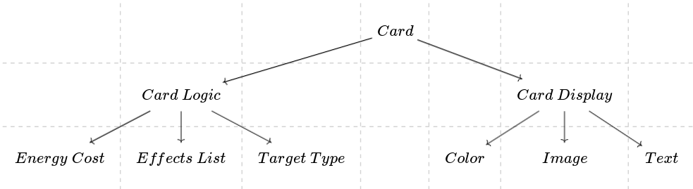

# Mathematics of Structure: Applied Category Theory For Game Development

Use the RPG stats graph as an example

## Intro to Category Theory - objects and arrows
## Sample of larger ideas from Category Theory
### Product
A product in Category Theory is the abstracted idea of a Cartesian product in Set Theory. The most basic idea of the product is that we have a product object `c` from which we can derive the components `a` and `b` that make up object `c` [like so](https://q.uiver.app/#q=WzAsMyxbMSwwLCJjIl0sWzAsMSwiYSJdLFsyLDEsImIiXSxbMCwxLCJwIiwxXSxbMCwyLCJxIiwxXV0=):

If you dig deeper into the literature, you'll come across the the formal definition, which is a little bit more complex. Summarized it means the following must hold:
- There is a projection arrow `p` from the product object `c` to the object `a`
- There is a projection arrow `q` from the product object `c` to the object `b`
- There is a candidate object `c'` with 3 arrows:
    - `p'` from `c'` to `a`
    - `q'` from `c'` to `b`
    - A factoring arrow `m` from `c'` to `c`
What makes `c` the product of `a` and `b` instead of `c'` is the existance of the factoring arrow `m` also factors the morphisms `p'` and `q'`, such that:
- `p' = p∘m`
- `q' = q∘m`

When diagrammed, it looks like [this](https://q.uiver.app/#q=WzAsNCxbMSwxLCJjIl0sWzAsMiwiYSJdLFsyLDIsImIiXSxbMSwwLCJjJyJdLFswLDEsInAiLDFdLFswLDIsInEiLDFdLFszLDEsInAnIiwxLHsiY3VydmUiOjJ9XSxbMywyLCJxJyIsMSx7ImN1cnZlIjotMn1dLFszLDAsIm0iLDAseyJzdHlsZSI6eyJib2R5Ijp7Im5hbWUiOiJkb3R0ZWQifX19XV0=):

This is the universal constructor for a product, but the gist of it is that it corresponds to the following ideas:
- Cartesian Product in Set Theory
- Logical conjunction (`∧` - `AND`)
- Objects in Object Oriented Programming
- Objects in JSON and JavaScript
- Records in other programming languages
- Tuples

It's important to note that the product gets its name from the number of possible composites that construct it (you multiply the possible values for each component to get the number of values the composite can be).

#### How This Applies to Game Design
Let's consider _Slay the Spire_, every card has the following components:
- An energy cost
- A list of effects
- A target type (player, single enemy, random enemy, all enemies)
- A color
- An image
- Text

When represented as a product category, it would look like [this](https://q.uiver.app/#q=WzAsNyxbMiwwLCJDYXJkIl0sWzAsMiwiRW5lcmd5XFwgQ29zdCJdLFsxLDIsIkVmZmVjdHNcXCBMaXN0Il0sWzIsMiwiVGFyZ2V0XFwgVHlwZSJdLFszLDIsIkNvbG9yIl0sWzQsMiwiSW1hZ2UiXSxbNSwyLCJUZXh0Il0sWzAsMV0sWzAsMl0sWzAsM10sWzAsNF0sWzAsNV0sWzAsNl1d):

We can group these components based on how they would be used in the game, separating them into logical and display components:
- Logical components
    - An energy cost
    - A list of effects
    - A target type (player, single enemy, random enemy, all enemies)
- Display components
    - A color
    - An image
    - Text

Which represented as a product category looks like [this](https://q.uiver.app/#q=WzAsOSxbMSwxLCJDYXJkXFwgTG9naWMiXSxbMCwyLCJFbmVyZ3lcXCBDb3N0Il0sWzEsMiwiRWZmZWN0c1xcIExpc3QiXSxbMiwyLCJUYXJnZXRcXCBUeXBlIl0sWzQsMiwiQ29sb3IiXSxbNSwyLCJJbWFnZSJdLFs2LDIsIlRleHQiXSxbNSwxLCJDYXJkXFwgRGlzcGxheSJdLFszLDAsIkNhcmQiXSxbMCwxXSxbMCwyXSxbMCwzXSxbNyw0XSxbNyw1XSxbNyw2XSxbOCwwXSxbOCw3XV0=):

This will be the representation I'll be working with for later examples.

### Coproduct
A coproduct in Category Theory is the categorical dual (co-) of a product, meaning it is the structure you get when [flipping the direction of the arrows](https://q.uiver.app/#q=WzAsMyxbMSwxLCJjIl0sWzAsMCwiYSJdLFsyLDAsImIiXSxbMSwwLCJpIiwxXSxbMiwwLCJqIiwxXV0=):

The formal definition for a coproduct then follows a similar construction:
- There is an injection arrow `i` from the object `a` to the coproduct object `c`
- There is an injection arrow `j` from the object `b` to the coproduct object `c`
- There is a candidate object `c'` with 3 arrows:
    - `i'` from `a` to `c'`
    - `j'` from `b` to `c'`
    - A factoring arrow `m` from `c` to `c'`
Just like the universal construction for the product, `c` in this category is the coproduct of `a` and `b` instead of `c'` because the factoring arrow `m` factors the morphisms `i'` and `j'`, such that:
- `i' = m∘i`
- `j' = m∘j`

Which when diagrammed, looks like [this](https://q.uiver.app/#q=WzAsNCxbMSwxLCJjIl0sWzAsMCwiYSJdLFsyLDAsImIiXSxbMSwyLCJjJyJdLFsxLDAsImkiLDFdLFsyLDAsImoiLDFdLFsyLDMsImonIiwxLHsiY3VydmUiOi0yfV0sWzEsMywiaSciLDEseyJjdXJ2ZSI6Mn1dLFswLDMsIm0iLDAseyJzdHlsZSI6eyJib2R5Ijp7Im5hbWUiOiJkb3R0ZWQifX19XV0=)

The core concept behind the coproduct is that it represents the concept of _choice_. Like the product, it corresponds to several ideas:
- Disjoint Union in Set Theory
- Logical Disjunction (`∨` - `OR`)
- Sum types
- Enum types
- Tagged unions in `C`
    - Tagged unions can be implemented in any programming language, but are more common in languages lacking support for algebraic data types. What's interesting to note that they are technically a product type of an enum and a block of memory, with the block of memory interpreted according to the enum.

#### How This Applies to Game Design
Going back to _Slay the Spire_, each component from the above is actually a coproduct:
- The [energy cost](https://q.uiver.app/#q=WzAsNixbMiwxLCJFbmVyZ3lcXCBDb3N0Il0sWzAsMCwiMCJdLFsxLDAsIjEiXSxbMiwwLCIuLi4iXSxbNCwwLCJYIl0sWzMsMCwi4oieIl0sWzEsMF0sWzIsMF0sWzMsMF0sWzQsMF1d) can (hypothetically) take the value of any non-negative integer OR `X`
- Every [effect](https://q.uiver.app/#q=WzAsMTcsWzMsNSwiRWZmZWN0Il0sWzIsMCwiRGFtYWdlIl0sWzQsMCwiRHJhd1xcIENhcmQiXSxbMSwxLCJFbmRcXCBUdXJuIl0sWzIsMSwiRXhoYXVzdCJdLFszLDEsIkV0aGVyZWFsIl0sWzAsMiwiQWRkXFwgQnVmZiJdLFsxLDIsIkFkZFxcIERlYnVmZiJdLFsyLDIsIkNoYW5uZWxcXCBPcmIiXSxbMywyLCJFdm9rZVxcIE9yYiJdLFszLDAsIkJsb2NrIl0sWzQsMiwiQ2hhbmdlXFwgU3RhbmNlIl0sWzUsMiwiRXhpdFxcIFN0YW5jZSJdLFs0LDEsIkFkZFxcIEVuZXJneSJdLFs1LDEsIkFkZFxcIFBvd2VyIl0sWzYsMiwiQ3JlYXRlXFwgQ2FyZHMiXSxbMywzLCIuLi4iXSxbNiwwXSxbNywwXSxbOCwwXSxbMTYsMF0sWzksMCwiIiwyLHsiY3VydmUiOi0xfV0sWzExLDBdLFsxMiwwXSxbMTUsMF0sWzMsMF0sWzQsMF0sWzUsMCwiIiwyLHsiY3VydmUiOjF9XSxbMTMsMF0sWzE0LDBdLFsxLDBdLFsxMCwwLCIiLDIseyJjdXJ2ZSI6LTJ9XSxbMiwwXV0=) in the list of effects can be one of either damage, draw, end turn, exhaust, poison, block, etc.
- The definition of the list of effects itself is a [recursive coproduct (with a product)](https://q.uiver.app/#q=WzAsNSxbMSwwLCJMaXN0XFwgRWZmZWN0Il0sWzAsMSwiTmlsIl0sWzEsMSwiQ29uc1xcIEVmZmVjdFxcIMOXXFwgKExpc3RcXCBFZmZlY3QpIl0sWzAsMiwiRWZmZWN0Il0sWzIsMiwiTGlzdFxcIEVmZmVjdCJdLFsxLDBdLFsyLDNdLFsyLDRdLFsyLDBdLFs0LDAsIiIsMCx7ImN1cnZlIjoyLCJsZXZlbCI6Miwic3R5bGUiOnsiaGVhZCI6eyJuYW1lIjoibm9uZSJ9fX1dXQ==), being defined as `List effect = Cons effect List effect | Nil
- The [target type](https://q.uiver.app/#q=WzAsNCxbMSwwLCJUYXJnZXRcXCBUeXBlIl0sWzAsMSwiUGxheWVyIl0sWzEsMSwiU2VsZWN0ZWRcXCBFbmVteSJdLFsyLDEsIkFsbFxcIEVuZW1pZXMiXSxbMSwwXSxbMiwwXSxbMywwXV0=) can be the player, a selected enemy, or all enemies
- The [color](https://q.uiver.app/#q=WzAsNixbMiwwLCJDb2xvciJdLFswLDEsIlJlZCJdLFsxLDEsIkdyZWVuIl0sWzIsMSwiQmx1ZSJdLFszLDEsIlB1cnBsZSJdLFs0LDEsIkNvbG9ybGVzcyJdLFsxLDBdLFsyLDBdLFszLDBdLFs0LDBdLFs1LDBdXQ==) is one of red, green, blue, purple, or colorless
    - Strictly speaking, it could technically be any possible color representable with RGB pixel values, but in the context of playable cards the color is limited to this subset
- The image can technically be any possible permutation of colored pixels, but in practice it's a curated set of images
- The text, like the list of effects, is actually a [recursive coproduct of all possible characters](https://q.uiver.app/#q=WzAsOCxbMywwLCJMaXN0XFwgQ2hhcmFjdGVyIl0sWzIsMSwiTmlsIl0sWzMsMSwiQ29uc1xcIENoYXJhY3RlclxcIMOXXFwgKExpc3RcXCBDaGFyYWN0ZXIpIl0sWzEsMiwiQ2hhcmFjdGVyIl0sWzQsMiwiTGlzdFxcIENoYXJhY3RlciJdLFswLDMsImEiXSxbMSwzLCJiIl0sWzIsMywiLi4uIl0sWzEsMF0sWzIsM10sWzIsNF0sWzIsMF0sWzQsMCwiIiwwLHsiY3VydmUiOjIsImxldmVsIjoyLCJzdHlsZSI6eyJoZWFkIjp7Im5hbWUiOiJub25lIn19fV0sWzUsM10sWzYsM10sWzcsM11d)
    - This is no coincidence, many programming languages actually implement strings (text) as a list of characters

If we combine these with the original card product category, the card category looks like [this](https://q.uiver.app/#q=WzAsMzgsWzcsMiwiQ2FyZFxcIExvZ2ljIl0sWzIsNCwiRW5lcmd5XFwgQ29zdCJdLFsxMCw0LCJUYXJnZXRcXCBUeXBlIl0sWzE1LDQsIkNvbG9yIl0sWzE4LDQsIkltYWdlIl0sWzIwLDQsIlRleHQiXSxbMTgsMiwiQ2FyZFxcIERpc3BsYXkiXSxbMTIsMCwiQ2FyZCJdLFs5LDUsIlBsYXllciJdLFsxMCw1LCJTZWxlY3RlZFxcIEVuZW15Il0sWzExLDUsIkFsbFxcIEVuZW1pZXMiXSxbMTMsNSwiUmVkIl0sWzE0LDUsIkdyZWVuIl0sWzE1LDUsIkJsdWUiXSxbMTYsNSwiUHVycGxlIl0sWzE3LDUsIkNvbG9ybGVzcyJdLFsyMCw1LCJMaXN0XFwgQ2hhcmFjdGVyIl0sWzIwLDYsIkNvbnNcXCBDaGFyYWN0ZXJcXCDDl1xcIChMaXN0XFwgQ2hhcmFjdGVyKSJdLFsxOSw2LCJOaWwiXSxbMjEsNywiTGlzdFxcIENoYXJhY3RlciJdLFsxOCw3LCJDaGFyYWN0ZXIiXSxbMTcsOCwiYSJdLFsxOCw4LCJiIl0sWzE5LDgsIi4uLiJdLFs3LDQsIkxpc3RcXCBFZmZlY3QiXSxbNyw1LCJDb25zXFwgRWZmZWN0XFwgw5dcXCAoTGlzdFxcIEVmZmVjdCkiXSxbOCw2LCJMaXN0XFwgRWZmZWN0Il0sWzYsNiwiRWZmZWN0Il0sWzYsNSwiTmlsIl0sWzQsNywiRGFtYWdlIl0sWzUsNywiQmxvY2siXSxbNiw3LCJEcmF3XFwgQ2FyZCJdLFs3LDcsIi4uLiJdLFswLDUsIjAiXSxbMSw1LCIxIl0sWzIsNSwiLi4uIl0sWzMsNSwi4oieIl0sWzQsNSwiWCJdLFswLDFdLFswLDJdLFs2LDNdLFs2LDRdLFs2LDVdLFs3LDBdLFs3LDZdLFs4LDJdLFs5LDJdLFsxMCwyXSxbMTEsM10sWzEyLDNdLFsxMywzXSxbMTQsM10sWzE1LDNdLFsxNiw1XSxbMTgsMTZdLFsxNywxNl0sWzE2LDE5LCIiLDIseyJjdXJ2ZSI6LTIsImxldmVsIjoyLCJzdHlsZSI6eyJoZWFkIjp7Im5hbWUiOiJub25lIn19fV0sWzIxLDIwXSxbMjIsMjBdLFsyMywyMF0sWzIwLDE3XSxbMCwyNF0sWzI0LDI2LCIiLDAseyJjdXJ2ZSI6LTIsImxldmVsIjoyLCJzdHlsZSI6eyJoZWFkIjp7Im5hbWUiOiJub25lIn19fV0sWzI4LDI0XSxbMjcsMjVdLFsyNiwyNV0sWzI1LDI0XSxbMjksMjddLFszMCwyN10sWzMxLDI3XSxbMzIsMjddLFszMywxXSxbMzQsMV0sWzM1LDFdLFszNiwxXSxbMzcsMV0sWzE5LDE3XV0=):

Note that this doesn't include status or curse cards. Technically these would be very similar categories but with different possible values for the color and omitting the energy cost and target type.

This isn't limited to just cards, several mechanics can be represented this way:
- All possible cards for a given character
- All possible relics
- All possible potions
- The deck
- All possible bosses for a given level

##### Aside
It seems like a lot of work for just aspect of a game, and when you pull it all together it touches on some very low level components that seem obvious, so what's the point of it all?

Categories are ultimately _tools for thought_, they are one method of reasoning about things. At some point _someone_ has to reason on this sort of level, which is typically the programmer because they are required to think on this level to translate it to a machine. By making this concrete up front, you gain the following benefits:
- It forces you to clarify your own thought process, which can lead to:
    - Detecting errors in your reasoning
    - Finding missing pieces in your design
    - Detecting circular reasoning in game mechanics
        - **_NOTE:_** Feedback mechanisms are different, and some definitions, such as the example above, can in fact be recursive, so the presence of cycles may in fact be necessary or even a _good thing_. The way to differentiate between these is understanding what exactly the diagram represents.
- You gain a clear method of communication between team members who may not have the same understanding as you do.
    - Team members can contribute their own ideas graphically as well.
- You gain visibility on all of the requirements that need to be made, which can aid project management and setting expectations.
- You gain an understanding of the complexity of your system.
    - For tabletop games, the rule of thumb is that [on average, people can only keep track of 7 things (plus or minus 2) in working memory](https://en.wikipedia.org/wiki/The_Magical_Number_Seven,_Plus_or_Minus_Two). Having too many things for people to remember to do without [chunking](https://en.wikipedia.org/wiki/Chunking_(psychology)) properly will result in a worse experience for players.
    - For video games, you aren't as constrained mechanically as with tabletop games, but you _are_ constrained by the hardware in how much can be stored in memory and how much can be processed per second. Here you generally want to maintain at least 60 FPS before performance will degrade to noticeable levels. If you start noticing performance issues, you can use the category diagrams in addition to typical debugging tools to help locate the problem.

### Functors
### Monoids
### Monads
### Comonads
## Show programming examples
  - Haskell -> F# -> C# -> C++ -> Rust -> C
## How do we apply this to game design?
### Game mechanics design
  - Finding loops and potential exploits
  - Finding best and worst stats (most and least connections between other stats)
  - Balancing mechanics by giving them roughly the same number of connections (including free connections)
### Location connections design
### Transportation connections design (eg. fast travel)
### Event time-line design
  - Tracking minimum possible paths through a quest line and balancing
### Cartesian product of event time-lines and locations (open world design and preventing dissonance with sequence breaking)
### Character relationships design
  - Finding which characters should be focused on and which ones should be cut
### Connections between characters and the plot
  - Finding which characters need clear and understandable motives, as well as more screen time (it's the ones with the most connections to the plot)
### Story themes and making connections with the plot
  - Reinforcing the main story themes with side quests
  - Reinforcing the main story themes with game mechanics
  - Reinforcing the main story themes with character relationships
## Pulling it all together
## Resources and references
https://existentialtype.wordpress.com/2011/03/
https://www.cs.cmu.edu/~rwh/talks/morgenstern.pdf
https://en.m.wikipedia.org/wiki/Brouwer%E2%80%93Heyting%E2%80%93Kolmogorov_interpretation
https://www.sciencenews.org/article/one-most-abstract-fields-math-finds-application-real-world
https://www.reddit.com/r/lacan/comments/shr325/lacans_real_computational_trinitarianism/?rdt=46278
http://comonad.com/reader/2018/computational-quadrinitarianism-curious-correspondences-go-cubical/
https://ncatlab.org/nlab/show/Chaitin%27s+incompleteness+theorem
https://news.ycombinator.com/item?id=37847282
https://www.physicsforums.com/insights/higher-category-theory-physics/
https://abuseofnotation.github.io/category-theory-illustrated/10_functors/